# USDX Azure Starter Hands-On Lab 2016

## Lab Objectives
[Lab Objectives]: http://www.msn.com

1. Identify sections in Azure Portal for common cloud solutions i.e. (App Services, Data Storage, and Compute)

2. Configure and publish simple Web App from Visual Studio that displays custom static text
3. Construct a Web API with 4 endpoints that allows a client to perform calculations using server logic
4. Build a more engaging app experience using the Project Oxford Speech API and SDK.

## Software Prerequisites

- Windows 10 PC
- [Free MS FTE MSDN Subscription](http://b6dmsdndevvm01.redmond.corp.microsoft.com/IO/)
- [Visual Studio 2015 Professional](https://go.microsoft.com/fwlink/?LinkId=691980&clcid=0x409)
- [Visual Studio Windows 10 Developer Tools](https://go.microsoft.com/fwlink/p/?LinkId=619629)
- [Azure SDK for .NET (Version 2.8.1)](http://go.microsoft.com/fwlink/?linkid=518003&amp;clcid=0x409)

## The Azure Portals

In this task, we will take a guided exploration of both the new Azure portal and the classic Azure portal. Use the portal to locate Azure services utilized for common cloud solutions. Identify key comparisons and service differences between legacy and current portal. View Azure marketplace, service plugins, service extensions, subscription management, and billing.

### Activities: Tour of Azure

#### The Lap Around Azure

Welcome to the World of Azure!

- Navigate to [**https://portal.azure.com**](https://portal.azure.com)
- **Login** with your **Azure credentials** and second authentication
- Once signed in, you&#39;ll hit the landing page for the new portal which contains a customizable starting hub to help manage your services

 

 
- The left-hand side of the page contains a menu to create and manage the most common Azure services
- The center of the page contains a Dashboard of Azure service tiles the user has pinned for quick access
- The top-right of the page contains links for settings, help, and changing your Azure subscription

*Note: The new portal&#39;s hub radically simplifies building, deploying, and managing your cloud resources. Imagine a single, easy-to-use console built just for you, your team, and your projects*
 
##### Lets Begin – Selecting Services

- **Select** the **New** button in the top-left of your screen.

 
 
 

- Here you&#39;ll see a blade for categories of Azure services as well as a link to the Azure Marketplace
- As you select a category, a new blade opens with all the available services for that category
- **Select** the **Compute** category. Notice the category of available services mostly contains different virtual machine images
- Scroll down the available services list and **select** the **Cloud Service** option
- You&#39;ll now see a blade that allows you to configure and create a new **Cloud Service**

 
 
 

*Note: Cloud Services is an example of Platform-as-a-Service (PaaS). This technology is designed to support applications that are scalable, reliable, and cheap to operate. They are hosted on VMs, but you have more control over the VMs on contrast to other PaaS applications. You can install your own software on Cloud Service VMs and you can remote into them.*

 
 
 

- Navigate back to the New Service Blade by selecting **New** in the navigation tabs above the config display

 
 
 

- Select the **Web + Mobile** Solutions Tab
- Here you can find Common Azure Applications developers use to deploy web and mobile solutions in Azure

 
 
 

- Navigate to the **Data + Storage** solutions tab

 

 

- **SQL Database** is a relational database-as-a-service that makes deploying and managing databases hassle-free and easy for developers

 

 

- **Azure DocumentDB** is a NoSQL document database for big data solutions handling JSON data that require easy scaling and high availability.

 

 

- Navigate to **Storage Account** in the **Data + Storage** category and click **Create**.
- In this service configuration, you can edit the options of:
  - Deployment Model – Use the new Resource Manager model or the Classic model for deploying the service.
  - Name your service. The service name also defines the url where your storage account is publicly accessible.
  - Type refers to redundancy options for your data. Local redundancy means Azure will make 3 copies of your data within a data center, geo-redundancy means Azure will make an additional 3 copies in a separate data center.

 
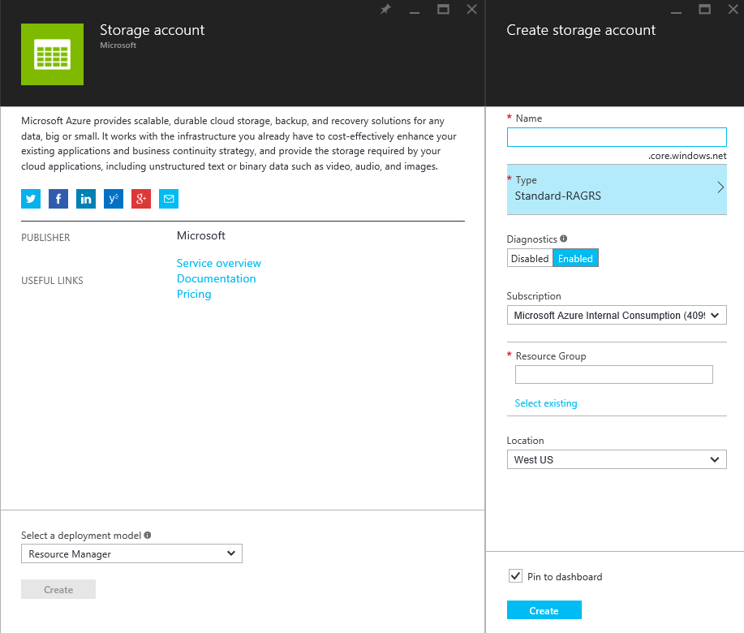  
 

- Within the **Create storage account** blade, select **Type**
- Here you can see the pricing options for availability and redundancy for your storage account
- This blade also gives you a breakdown of feature sets between the availability tiers

 
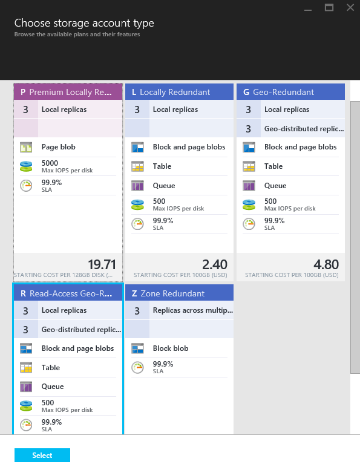
 

 

 

- Navigate back to the **New** menu function.

 
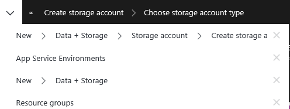
 

 

 
 
- In the New blade, select the **Data + Analytics** category
- Navigate to **Machine Learning** and notice the icon next to the name. This icon signifies that the Azure service must be configured in the classic/legacy portal
- Select the **Machine Learning** service. A new browser tab or window will open – one containing the new portal and a new one with the classic/legacy portal

*Note: Some services have not been configured in the new portal and require the legacy portal to provision*

- In the classic portal, click the **&#39;X&#39;** to close the blade for Machine Learning. **Do not close the browser window!**

 
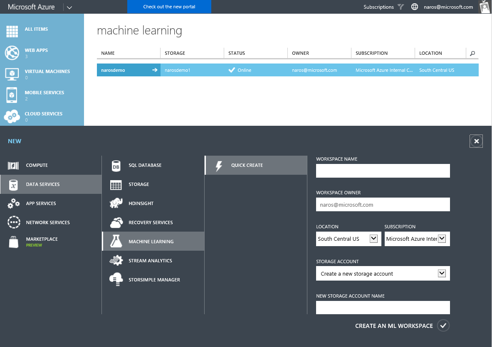
 

 

 

- On the left-side of the screen you&#39;ll see the menu of Azure services
- Notice the layout, menu, and color differences between legacy portal and the current portal
- In the classic portal, click the email address found in the top-right corner to drop down a list of available options

 

 

 
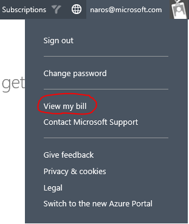
 

- In the Drop down menu for your Account setting select **View my bill**
- A new browser tab will open. The new tab will contain a summary for your subscriptions as well as the amount to be charged for your Azure consumption

*Note: Your subscription name may be different than the name below. You may also have multiple subscriptions*

- Use the navigation tabs at the top to view your marketplace apps, profile details and preview features you can activate on your description

 

 

 

 

- In your browser, switch tabs back to the **new portal**
- On the left-hand menu, select **Subscriptions**
- In the **Subscriptions** blade, select one of the subscriptions

*Note: You may have multiple subscriptions and the names of those subscriptions may be different than shown below*

 

 

- After selecting one of your subscriptions, you will see a blade with a breakdown of charges and spend for your subscription. This should be empty to you since you have not deployed a service yet

 
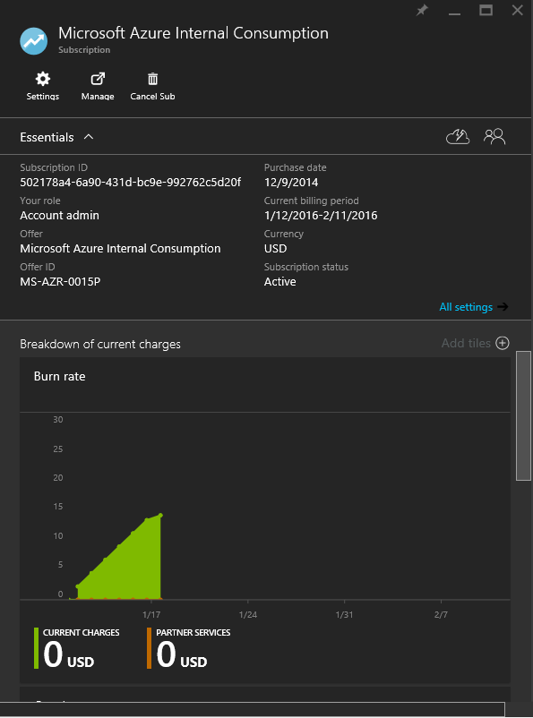
 

 
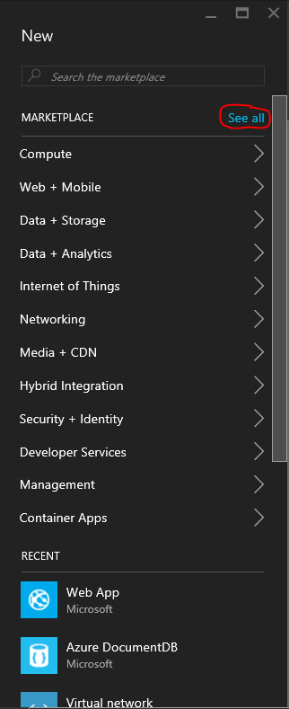
 

- Close the subscription blades and click the **New** menu item and then click **See All** next to the **Marketplace**
- This brings you to the **Azure Marketplace**. The **Azure Marketplace** offers developers a store of thousands of certified, open source, community software applications, and developer services

 

 

- **Congratulations!**  You are now familiar with both Azure portals as well as the services offered in each.

## &quot;Hello World&quot; - Azure

Using Visual Studio, configure and publish a Web App to the cloud displaying static text &quot;Hello World.&quot; View the app in portal and identify all additional configuration tools to enhance the app. Remove &quot;Hello World&quot; Azure services using Resource Groups.

### Activities: Create Web App service in the Azure portal and publish using Visual Studio.

#### Publishing Your first Azure App

- Sign in to the  [Azure Portal](https://portal.azure.com/).
- Click the  **+ NEW**  icon on the top left of the Azure Portal.
- Click  **Web + Mobile** , and then click  **Web App**.

 
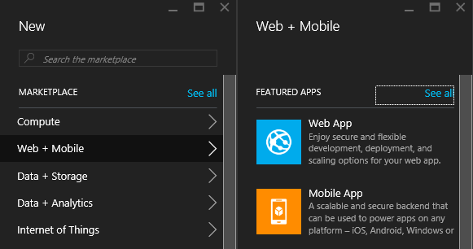
 

- Enter a name for the web app. The name must be unique because it will also be the URL of your website. If the name you enter is not unique, a red exclamation mark appears in the text box.
- Try using the following naming convention:  &lt;Your alias&gt; + &quot;hol1&quot; + service acronym.  For example, my alias is &quot;naros&quot; and I&#39;m creating a Web App so I would enter, &quot;naroshol1wa&quot;
- After entering a name, select a  **subscription**.
- After selecting a subscription, select a  **Resource Group**  or create a new one. Follow the same naming convention as before: &lt;Your alias&gt; + &quot;hol1&quot; + &quot;rg&quot; for **Resource Group**. For example, I would use &quot;naroshol1rg&quot;
- A **Resource Group** is a logical container for one or more Azure services. It ensures related services are physically deployed as close as possible to reduce latency while also ensuring those services are on different update and fault domains. For example, if I have a website and database, I can place the web app, database, and any other Azure services the websites needs in a group.
- Select an  **App Service Plan/Location**  or create a new one and use the same naming convention. It&#39;s recommended that you create your **App Service Plan** in a location that&#39;s close to you.
- Click  **Create**.

*NOTE: The following is an example. Your name, subscription, resource group, and app service plan will be different.* 

 
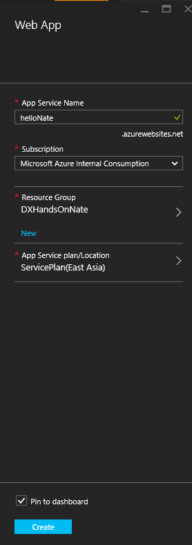
 

- After clicking **Create** , the blades will close and you&#39;ll be returned to the **Dashboard**. Notice one of your Dashboard tiles shows that your Web App is being created.

#### Create your Web App

In this section, you&#39;ll create your first Web App using Visual Studio. Both Visual Studio and Azure can support various web application types (e.g. node, ASP.NET, PHP). However, for our first app, we will create a web page using HTML markup.

- Open **Visual Studio** and click **&#39;New Project...**&#39; under the &#39; **Start&#39;** section heading.
- Select **&#39;Web&#39;** from the templates menu and then select **&#39;ASP.NET Web Application&#39;** from the list of installed templates.Specify a **name, location,** and solution **name** or leave the default values.
- Click the &#39; **OK&#39;** button to create the new project.

 

 

- On the next screen, select **Empty** for the **ASP.NET 4.5 Template** and make sure that **&#39;No Authentication&#39;** and **&#39;Host in the cloud**&#39; is **NOT** checked.
- Click **&#39;OK&#39;** to create your project.

 
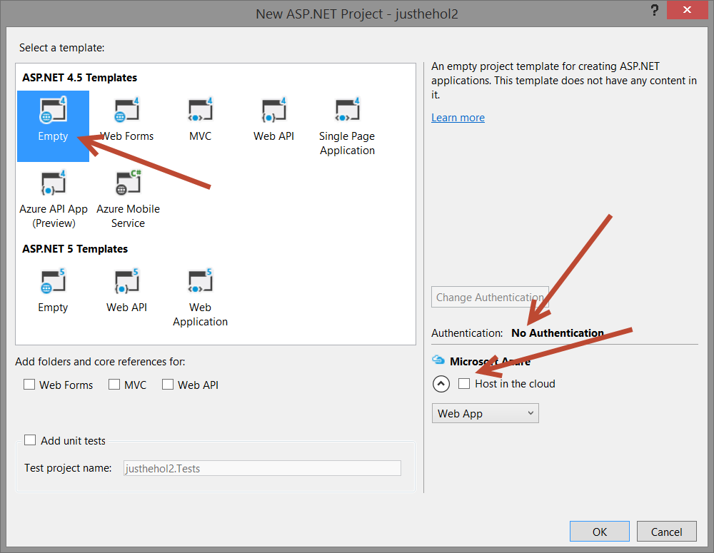
 

- Once Visual Studio has created your new empty project, we&#39;ll need to add an HTML page to your site.
- In the **Solution Explorer** window, right click your project, select **&#39;Add&#39;**, and then select **&#39;HTML Page&#39;** from the context menu.
- Name the HTML page **&#39;Index.html&#39;**

*NOTE: The name &#39;Index.html&#39; is reserved for the home page of your site. If you specify a different name, you may have issues when deploying your site.*

 

 

- You should now have an HTML page with basic HTML markup for your page.
- Update the title and body of your HTML page to look like the following:

 

 

- Now that your HTML page is complete. Let&#39;s publish to Azure.
- In the** Solution Explorer **, right click your project and select**&#39;Publish&#39; **.Select**&#39;Microsoft Azure App Service&#39; **from the list of publish targets.

 
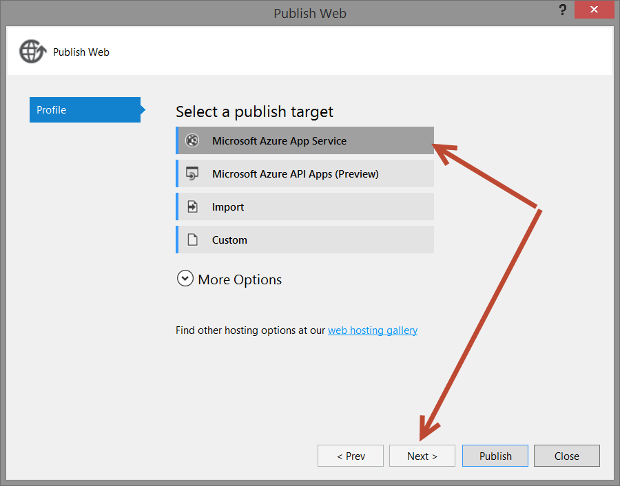
 

- On the next screen, make sure the selected user and subscription are the same as what you used to create the web app in Azure.
- Select your** App Service **from the list of existing app services.
- Click**&#39;OK&#39;** to proceed.

 

 

- The next screen contains your publish settings. Verify all fields have values and then click **&#39;Publish.&#39;**

 

 

- Visual Studio will now take a few moments to build and publish your website. Once complete, a new browser window will open with the HTML page you created.

**Congrats!** You are now a web developer.

 

 

## The Azure Web Calculator

Using Visual Studio, create an Azure Web App, a Web API project, and publish a Web API that does simple calculations (add, subtract, multiply &amp; divide) in the cloud. Construct a client application that leverages the calculations Web API and accurately outputs the results.

### Creating your Web API

- Open **Visual Studio** and click **&#39;New Project...**&#39; under the &#39; **Start&#39;** section heading.
- Select **&#39;Web&#39;** from the templates menu and then select **&#39;ASP.NET Web Application&#39;** from the list of installed templates.
- Specify a **name, location,** and solution **name** or leave the default values.
- Click the &#39; **OK&#39;** button to proceed.

 

 
 
- On the next screen, select **Azure API App** for the **ASP.NET 4.5 Templates,** ensure that **&#39;No Authentication&#39;** is selected, and **&#39;Host in the cloud**&#39; **IS** checked.
- Click **&#39;OK&#39;** to proceed.

 

 

- The next screen allows you to **configure** your **Web App** settings in Azure. You created this same Web App service in the Azure Portal in the previous section except this time we&#39;re using Visual Studio.
- Specify a **API App Name** or use the default value.
- Ensure the correct **Subscription** is selected.
- Create a new **Resource Group** using the following naming convention, &lt;Your Alias&gt; + &quot;hol2rg&quot;Create a new **App Service Plan** using the following naming convention, &lt;Your Alias&gt; + &quot;hol2asp&quot;As part of the **App Service Plan** , select &#39; **West US&#39;** for the region and click **&#39;OK&#39;** to create both your Azure Web App and your Web API project.

 
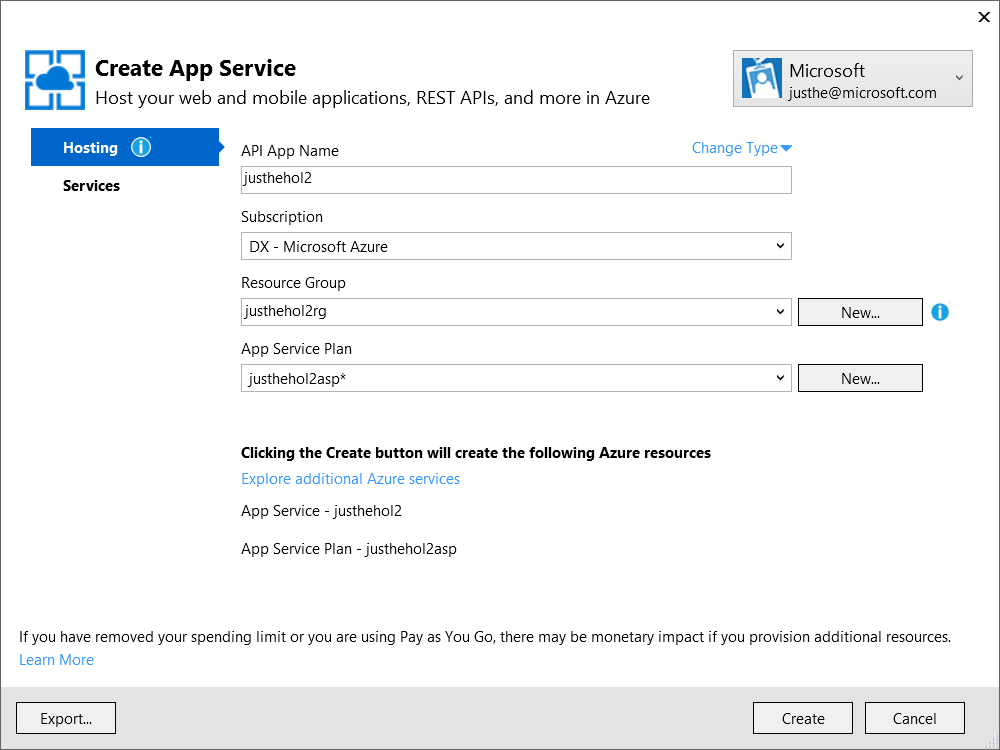
 

- Once your project is created, you&#39;ll see a readme file. You may close this file by clicking the **&#39;X&#39;** next to the tab.

**Now we need to create a controller for your Web APIs.**

- In the **Solution Explorer**, expand the **Controllers** folder and delete the existing **ValuesController** file by either selecting the file with your mouse and hitting the **Delete** key or by right clicking the file and selecting **Delete**.
- Now, right click the **Controllers** folder, select **Add** , and then select **Controller**.

 
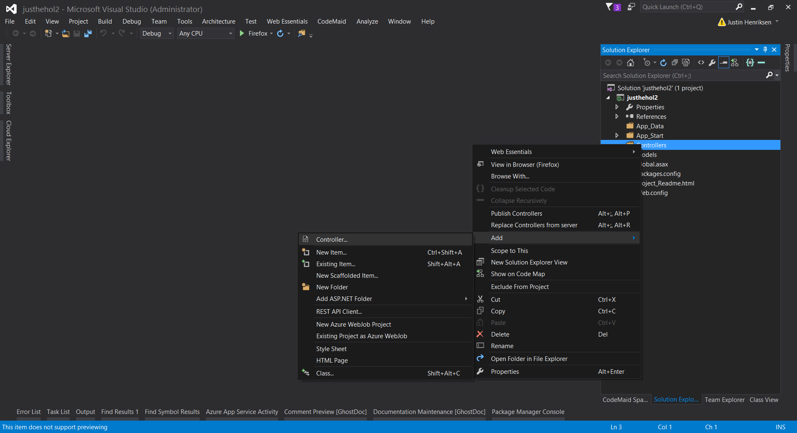
 

- A new window will open with a list of controller templates. Select **&#39;Web API 2 Controller – Empty&#39;** from the list and click **&#39;OK&#39;** to proceed.

 

 

- Enter **&#39;CalculateController&#39;** for the name of your controller and click **&#39;OK&#39;** to create your controller.
- You should now see a new, empty controller. This is where we will build endpoints for clients to communicate with our API.

*NOTE: Be sure to notice where the curly braces (&quot;{&quot;  &quot;}&quot;) are. In order to avoid errors, you must have opening and closing curly braces that line up.*

- Place your cursor inside the **CalculatorController** curly braces and type in the following code:
 
*NOTE: The CalculateController class is shown below to give you a point of reference. You should not create another CalculateController class.*

	public class CalculateController : ApiController
	{
		[HttpGet]
		[Route]
		public string Get()
		{
			return "The calculate controller is available.";
		}

		[HttpPut]
		[Route("")]
		public int Add([FromUri] int value1, [FromUri] int value2)
		{
			return value1 + value2;
		}
	}

*Note: The **[HttpGet]** and **[HttpPut]** attributes define the type of HTTP requests the API accepts. The **[Route]** attribute tells IIS what the URL should be for each API. An empty **[Route]** attribute indicates that API should be called when nothing else is specified in the URL. The **[Route(&quot;add&quot;)]** attributes tells IIS the user must add, &quot;/add&quot; to the end of the URL like this, http://yourwebsiteurl.com/add.*

*The **Get** method is empty and doesn&#39;t accept parameters. The **Add** method must be given two parameters as part of the URL. This will make more sense as we add the remaining endpoints and test our APIs.

Now we need to add APIs for **subtract** , **multiply** , and **divide**.

Directly after the closing curly brace &quot;}&quot; of the **Add** method, hit **Enter** twice to add two empty lines. Now add the following code:

	[HttpPut]
	[Route("subtract")]
	public int Subtract([FromUri] int value1, [FromUri] int value2)
    {
		return value1 - value2;
    }

Repeat the process for the **multiply** and **divide** APIs. Once complete, your file should look like the following:

	using System;
	using System.Collections.Generic;
	using System.Linq;
	using System.Net;
	using System.Net.Http;
	using System.Web.Http;
	
	namespace justhehol2.Controllers
	{
	    public class CalculateController : ApiController
	    {
			[HttpGet]
			[Route]
			public string Get()
			{
			    return "The calculate controller is available.";
			}
	
			[HttpPut]
			[Route("add")]
			public int Add([FromUri] int value1, [FromUri] int value2)
			{
			    return value1 + value2;
			}
	
			[HttpPut]
			[Route("subtract")]
			public int Subtract([FromUri] int value1, [FromUri] int value2)
			{
			    return value1 - value2;
			}

			[HttpPut]
			[Route("multiply")]
			public int Multiply([FromUri] int value1, [FromUri] int value2)
			{
			    return value1 * value2;
			}

			[HttpPut]
			[Route("divide")]
			public int Divide([FromUri] int value1, [FromUri] int value2)
			{
			    return value1 / value2;
			}
		}
	}

Now that our API is complete, let&#39;s test it.

- Run the API App locally in Edge, do this by Clicking the **Green Triangle** in the top tab.

 
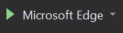
 

- You should see a window in **Edge** similar to the image below.

*Note: **localhost** indicates the site is running on your machine using the specified port - **62346**. The port number the app is running may be different for each machine. 

 
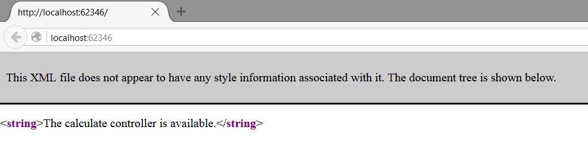
 

If your browser displays a similar message as above, our app is running correctly. We should now test our APIs.

- Click the red stop button in **Visual Studio** to stop testing.

 

 

We will now test our APIs using a library called **Swagger**. In order to use **Swagger**, we need to update the library using the **NuGet Package Manager**. 

##### Updating Swagger

- Using Visual Studio, right click the **References** folder and select **Manage NuGet Packages…**

 
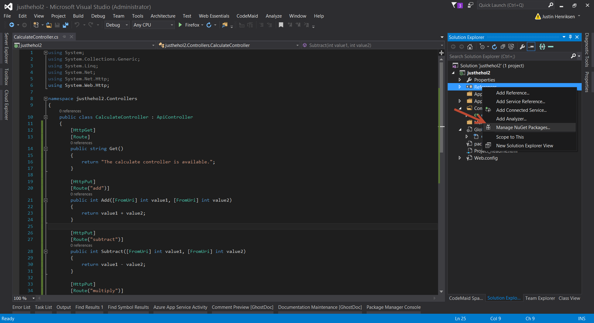
 

- In the **NuGet Package Manager** window, select the **Updates** tab.
- In the list of installed packages, find and select **Swashbuckle**, and click the **&#39;Update&#39;** button.
- A prompt may be displayed stating it is replacing the current **Swagger** file.
- Click **Yes to All.**

 

 

- Once the update is complete, close the NuGet tab, and click the **Green Triangle** to run the program again.

 

 

**Testing with Swagger**

- After the browser opens a new window, add, **&quot;/swagger&quot;** to the end of your URL. You should have something like the following: **http://localhost:[yourportnumber]/swagger**

 

 

- After updating **Swashbuckle**, each time we run our application, **Swagger** automatically examines our API and builds documentation and testing interfaces for us. Sweet!
- Click on the **&#39;Calculate&#39;** link to expand your API and see all endpoints.

 
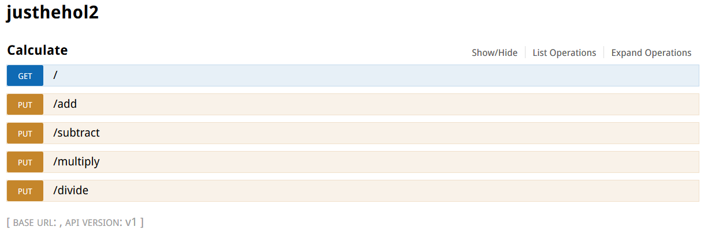
 

- Click the **Add** endpoint to test the endpoint&#39;s API.
- You should now see a UI for testing our API. The API expects 2 parameters in the URL and will return a JSON response.
- Enter **7** and **5** for the values and click **Try it Out.** 

 

 

- The window will expand displaying the **Curl**, **Request URL**, **Response Body**, **Response Code**, and **Response Headers**.

*Note: The **Response URL** shows us the URL called for the API. The **Response Body** contains the response from our API. Verify the integer displayed is correct.The **Response Code** of 200 indicates no errors.*

 
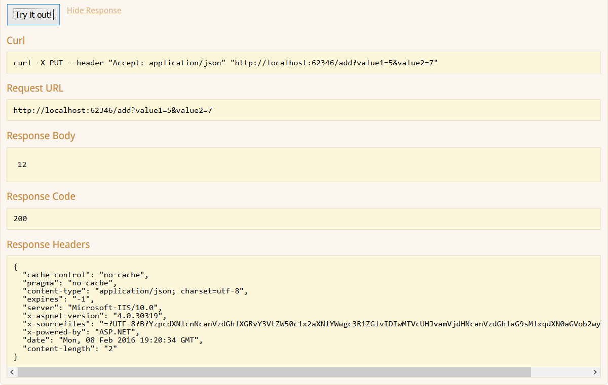
 

- Perform a similar test for your other API endpoints.
- Once completed, stop running you app locally by clicking the **Red Square.**

 

 

### Publish changes to your application

- In the **Solution Explorer,** right click your project and select **Publish.**

 
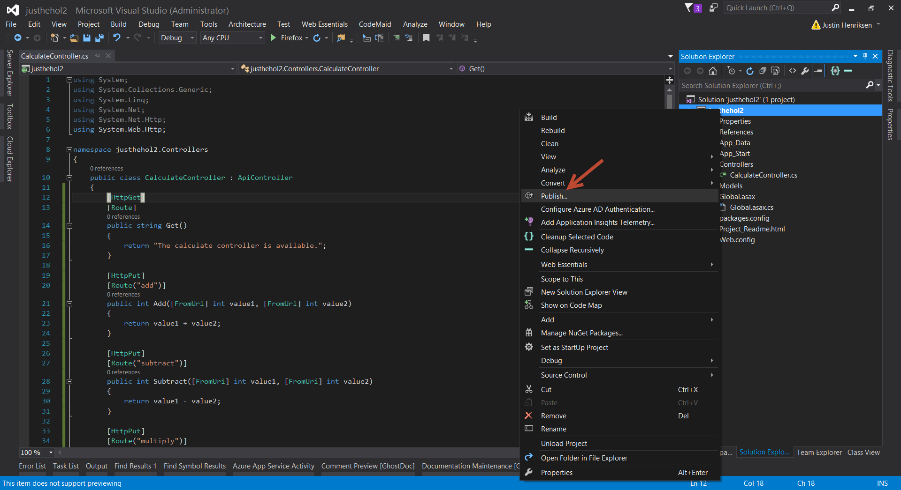
 

- The **Publish Web** window should already contain the values we entered upon creating the Web API project. Click **Publish**.

 

 

- A new browser window will open with the API App running on Azure. **(Note the URL)**

**Congrats! You have just created your own Calculator API App in Azure!**

### Connecting your Client

- In Visual Studio, right click the solution, **Solution [Your Solution Name]** in the Solution Explorer.
- Click  **Add** and then select  **New Project.**

 
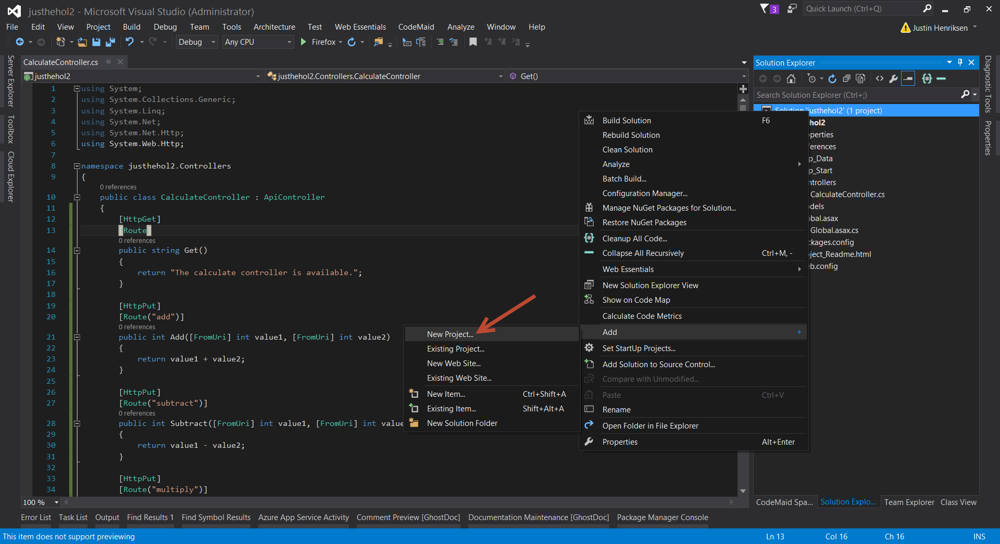
 

- Select **Blank App (Universal Windows)** from the **Universal** menu item under **Windows** templates.

*Note: Since UWP projects normally require debugging, your Windows 10 desktop may need to be switched to a **&#39;Developer Mode&#39;** configuration. Click **OK** if prompted.*

- Enter the name for the client UWP App. Try **[Your Alias] + &quot;HOLClient&quot;.**

 

 

- Once the new project is created, right click the new project and select **&#39;Set as StartUp Project&#39;** from the menu. The new project name should now be bold to indicate it&#39;s the startup project.
- In the **Solution Explorer** window, double click **MainPage.xaml** under your **Client** app.

 
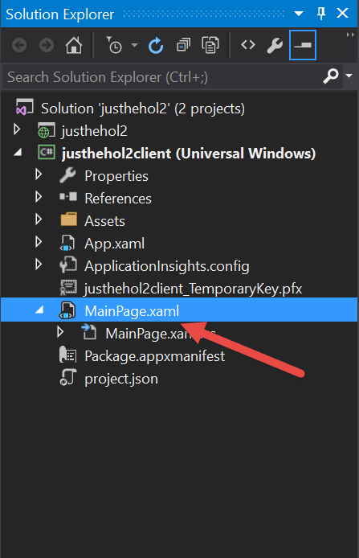
 

*Note: You may be asked to put your machine into **&#39;Developer Mode&#39;** at this point. Please do so by hitting the **Windows key** and searching for **Settings**. Once in **Settings**, type &#39; **For Developers&#39;** in the search box and select **Developer Mode**. You may need to restart **Visual Studio**.*

- After getting through the **Developer Mode** setup.
- Open the **MainPage.xaml** design window with a canvas for you to begin designing the UI for your app.
- In the canvas selection window, change the size of your canvas to better fit the device you&#39;re using. I am on a Surface Pro 3 so I selected **12&quot; Tablet (2160 x 1440) 150% scale**.

 
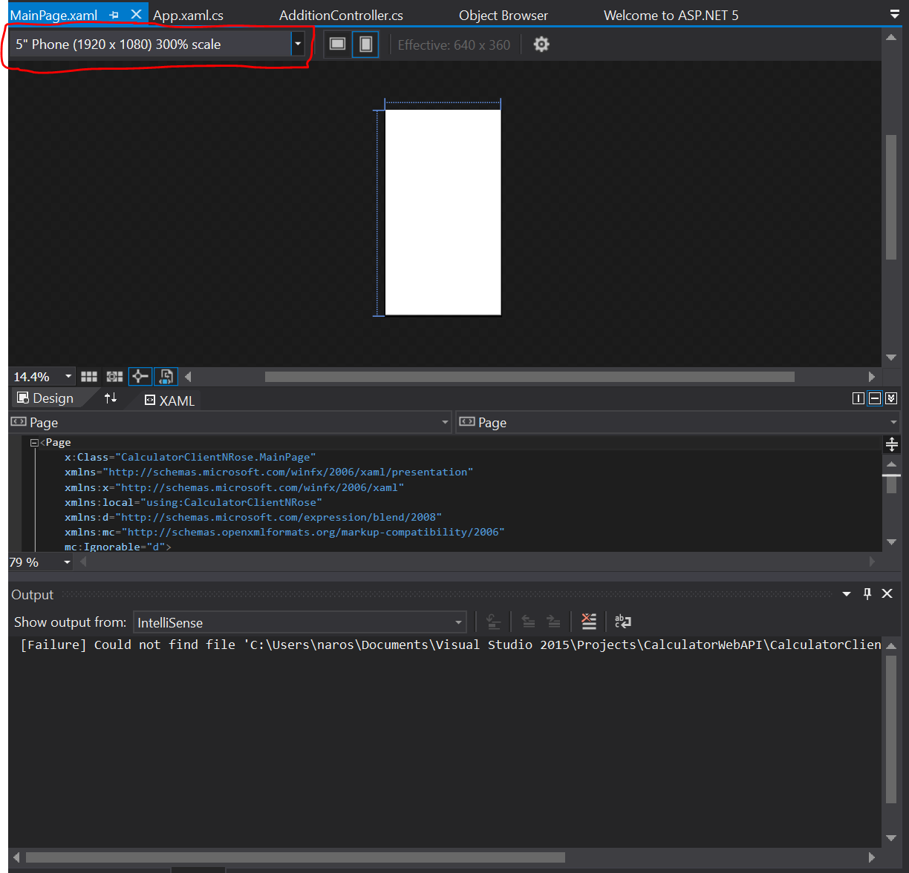
 

- On the left-hand side of the screen, find the **Toolbox Window** and expand the **Common XAML Controls** list.

*Note: If you do not see a Toolbox window in Visual Studio, Press **Ctrl +Alt +X** on your keyboard.*

 
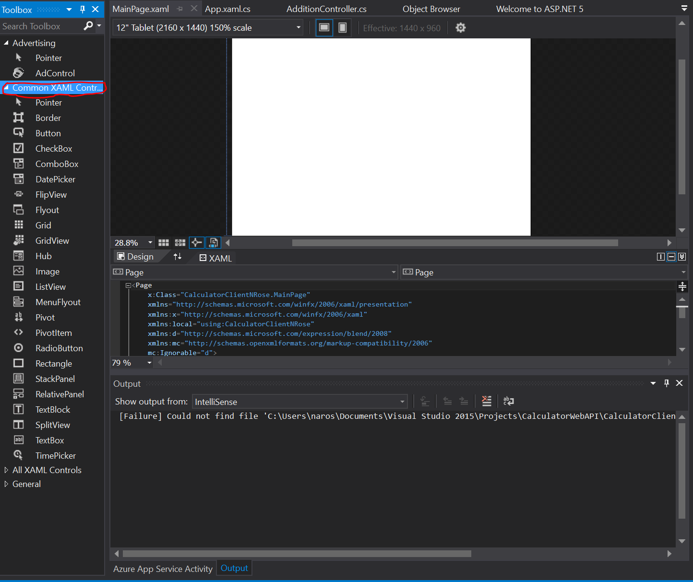
 

- From the **Toolbox**, **drag and drop**** two ****TextBox** controls onto the canvas.
- Use the **Zoom** located in the bottom left of the **Design Window** to view the textboxes better. Try **50%.**
- Click and drag the corners of each textbox to expand their size. Make sure they are large enough that you can type in a few numbers when you run the new app.
- Place the second textbox adjacent to the first. You will see red positioning lines to signify the boxes have lined up.

 
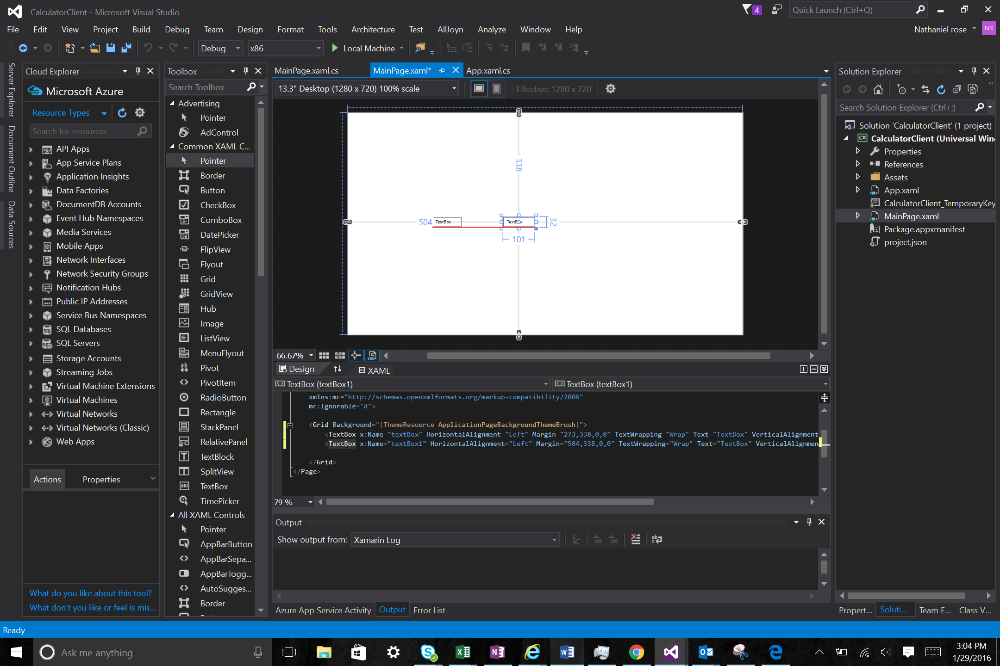
 

- Go to the toolbox window and **Drag and Drop** a **TextBlock** onto the canvas.
- Resize the **TextBlock** so it matches the size of the first **TextBlock** you added to your form.
- Place the **TextBlock** to the right of the 2 textboxes. You will see red positioning lines to signify the block has lined up 

 

 

- Go to the **Toolbox** window and **Drag and Drop** four **Buttons** onto the canvas.
- Place the buttons between the two text boxes.
- Stack the buttons vertically. Use the red positioning margin lines to align the buttons accordingly.

 

 

- Use the **Properties Window** to change the **Name** property for each control to something that indicates what control does like, textBox1, textBox2, resultTextBlock, buttonAdd, buttonSubtract, buttonMultiply, and buttonDivide.
- Also, set the **Text** property for the **TextBox** and **TextBlock** controls and the **Content** property for the **Button** controls.
- Time to add some code. On your **Canvas**, double click each **Button** control to automatically generate a click event handler. The event handler will run when the user clicks the button on your app.
- To see the generated code, right click one of your buttons and select **View Code**.  You should see a screen similar to the following:

 

 

The beginning of the code file contains references to libraries the app uses.

- Add **System.Threading.Tasks** and **Windows.Web.Http** as shown below. We will use functions in these libraries to communicate from our **Client** to our **Web API**.

 
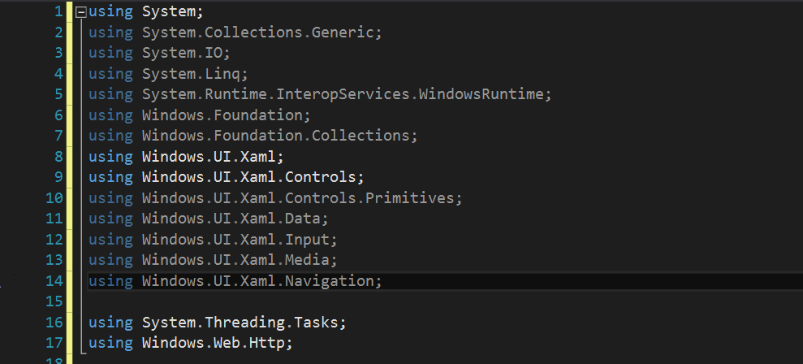
 

We are now going to add code so our client can communicate with our Web API.

- Add the following code directly beneath **&quot;public sealed partial class MainPage : Page&quot;**

 

 

*Note: Replace the string contents, **&quot;&lt;Your Web API&gt;&quot;** of the ApiUrl variable with your API&#39;s URL.  For example:public const string ApiUrl = &quot; [http://justhehol2.azurewebsites.net/{0}?value1={1}&amp;value2={2}](http://justhehol2.azurewebsites.net/%7b0%7d?value1=%7b1%7d&amp;value2=%7b2%7d)&quot;;. The **PutData** method takes three arguments. The operation to execute on our Web API and the numeric values for that operation.  The method then creates a new URL by replacing the **ApiUrl** variable with the arguments passed in. The **HttpClient** then calls our API and the result is placed in the results **TextBlock**.*

Next we&#39;ll update our button event handlers to call our **PutData** method.

- Add the following code inside each of your button event handlers:

*Note: Add the **async** keyword before the **void** keyword.*

 
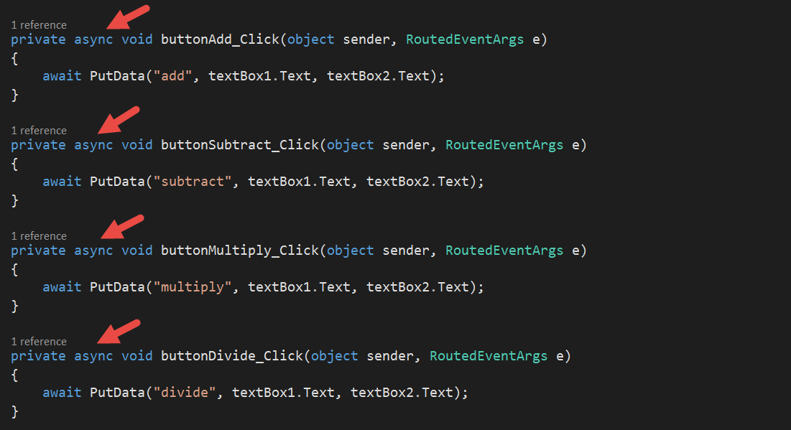
 

Your final code should be similar to this:

	using System;
	using System.Threading.Tasks;
	using Windows.UI.Xaml;
	using Windows.UI.Xaml.Controls;
	using Windows.Web.Http;
	// The Blank Page item template is documented at http://go.microsoft.com/fwlink/?LinkId=402352&amp;clcid=0x409

	namespace justhehol2client
	{
	    ///

	    /// An empty page that can be used on its own or navigated to within a Frame.
	    ///

	    public sealed partial class MainPage : Page
	    {
	        public const string ApiUrl = "http://justhehol2.azurewebsites.net/{0}?value1={1}&value2={2}";

	        private async Task PutData(string operation, string value1, string value2)        
			{
	            var uri = newUri(string.Format(ApiUrl, operation, value1, value2));            
				
				using (var httpClient = newHttpClient())
	            {
	                var response = await httpClient.PutAsync(uri, new HttpStringContent(""));
	                resultTextBlock.Text = response.Content.ToString();
	            }
	        }

	        public MainPage()
	        {
	            this.InitializeComponent();
	        }

	        private async void buttonAdd_Click(object sender, RoutedEventArgs e) 
			{
	            await PutData("add", textBox1.Text, textBox2.Text);
	        }

	        private async void buttonSubtract_Click(object sender, RoutedEventArgs e)        
			{
	            await PutData("subtract", textBox1.Text, textBox2.Text);
	        }

	        private async void buttonMultiply_Click(object sender, RoutedEventArgs e)        
			{
	            await PutData("multiply", textBox1.Text, textBox2.Text);
	        }

	        private async void buttonDivide_Click(object sender, RoutedEventArgs e)        
			{
	            await PutData("divide", textBox1.Text, textBox2.Text);
	        }
	    }
	}

- Once completed, **Run the application.**

*Note: If you receive an error message about your deployment, you&#39;ll need to update your settings. To do so, click **Build** from the top menu, select **Configuration Manager**, and make sure both **Build** and **Deploy** are checked.*

- Verify each button does the correct operation and displays the correct calculation.

**You are now a programmer!**

## Build a More Engaging App Experience

Using the Project Oxford Speech API, develop a Windows application by allowing the user type text and have that text synthesized to speech. The Project Oxford Speech API will then return an audio file for each block of text entered into the Windows Application.

### Project Oxford Speech API

#### Task 1 - Creating your project

In this task you will create your project in Visual Studio.

- Open **Visual Studio** and click **&#39;New Project...**&#39; under the &#39; **Start&#39;** section heading.
- Select **&#39;Windows&#39;** from the templates menu and then select **&#39;Console Application&#39;** from the list of installed templates.
- Specify a **name, location,** and solution **name** or leave the default values.
- Click the &#39; **OK&#39;** button to create the new project.

 

 

Once the project is created, you&#39;ll see Visual Studio&#39;s main IDE window with the Program.cs class loaded into the viewer. Depending on your IDE configuration, you may see other windows surrounding the main window like the Solution Explorer and Properties windows. Your project is now created.

 
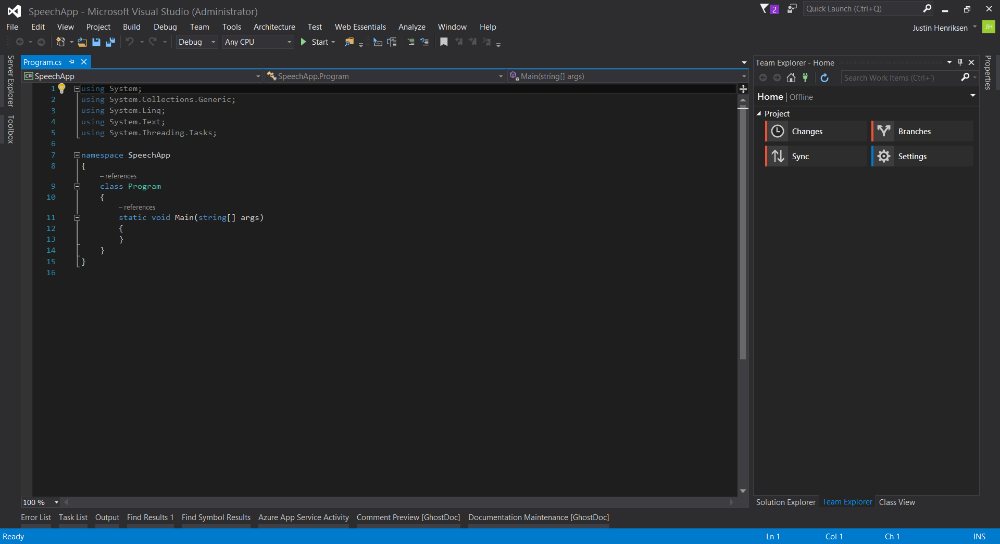
 

#### Task 2 - Adding a NuGet package to your project

In this task you will add a NuGet package to your project and reference that package in code.NuGet is the package manager for the Microsoft development platform including .NET. The NuGet client tools provide the ability to produce and consume packages.

- In Visual Studio, click on the **Tools** menu item, then click **NuGet Package Manager**, and then select **Package Manager Console**.

 
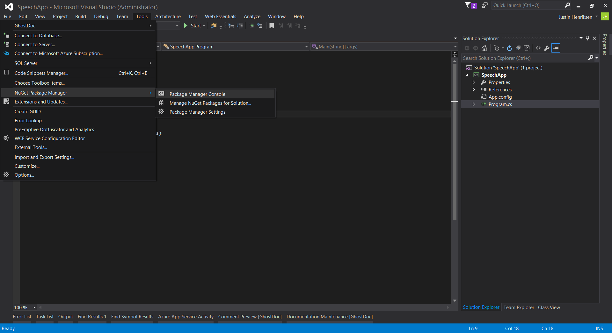
 

- Once the console windows opens, type the following command:

	install-package SpeechWrapper

The Speech Wrapper library has now been added as a reference to your project. You can verify by expanding the references folder in Visual Studio.

*Note: The Speech Wrapper library was created specifically for this hands-on lab for your convenience. It simplifies much of the complexity and configuration needed when consuming the Project Oxford Speech API.*

 
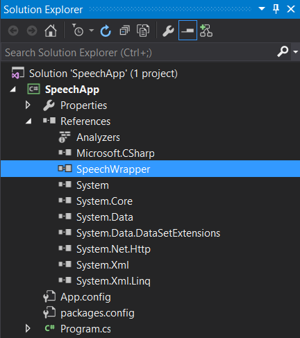
 

Now that the library has been added to our project, let&#39;s add a reference in code so we can use the library later on.

- Return to the **Program.cs** file and add the following code as the first line, above  **using System;**.

	using SpeechWrapper;

#### Task 3 - Add event handlers

In this task, you will add event handlers to your project for playing audio and reporting errors.

Add the following method directly below the **static void Main** method.

	private static void PlayAudio(object sender, GenericEventArgs<System.IO.Stream> args)	
	{
		// For SoundPlayer to be able to play the wav file, it has to be encoded in PCM.
	    // Use output audio format AudioOutputFormat.Riff16Khz16BitMonoPcm to do that.
	    var player = new System.Media.SoundPlayer(args.EventData);
	    player.PlaySync();
	    args.EventData.Dispose();
	}

The code above is an event handler, which plays an audio file. The event is triggered when the Speech API returns successfully.

- Add the following method directly below the  **private static void PlayAudio**.

	private static void ErrorHandler(object sender, GenericEventArgs<Exception> e)
	{
	    Console.WriteLine("Unable to complete the TTS request: [{0}]", e);
	}

The code above is an event handler, which handles errors returned from the Speech API. Errors will be displayed in the console window.

Your **Program.cs** file should now look like the following:

	using SpeechWrapper;
	using System;
	using System.Collections.Generic;
	using System.Linq;
	using System.Text;
	using System.Threading.Tasks;
	
	namespace SpeechApp
	{
	    class Program
	    {
	        static void Main(string[] args)
	        {
	        }

	        private static void PlayAudio(object sender, GenericEventArgs<System.IO.Stream> args)
	        {
	            // For SoundPlayer to be able to play the wav file, it has to be encoded in PCM.
	            // Use output audio format AudioOutputFormat.Riff16Khz16BitMonoPcm to do that.
	            var player = new System.Media.SoundPlayer(args.EventData);            
				player.PlaySync();
	            args.EventData.Dispose();
	        }

	        private static void ErrorHandler(object sender, GenericEventArgs<Exception> e)
	        {
	            Console.WriteLine("Unable to complete the TTS request: [{0}]", e);
	        }
	    }
	}

#### Task 4 - Subscribe to the Project Oxford Speech API

In this task we&#39;ll subscribe to the Project Oxford Speech API and copy our API key for later use.

- Navigate to the  [Project Oxford Speech API](https://www.projectoxford.ai/speech) ( [http://www.projectoxford.ai](http://www.projectoxford.ai)) and click the &#39;Subscribe&#39; button.

*Note: If you don&#39;t see the &#39;Subscribe&#39; button you may need to sign in using your Microsoft Account (LiveId).*

- Indicate that you agree to the terms of service by checking the box and then click the &#39;Subscribe&#39; button.

 
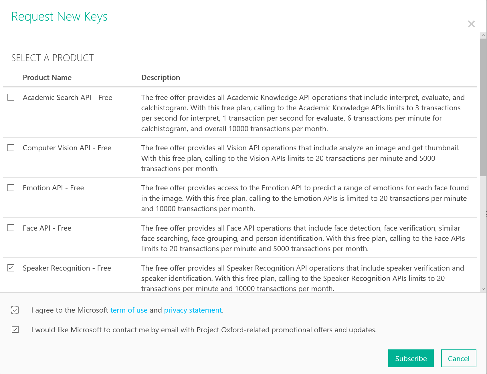
 

- You should now see all of your subscriptions to the Project Oxford APIs.

 

 

- Find the Speech API and click the &#39;Show&#39; link directly under the primary key for 
- that API. 
- Copy the primary key and paste it into notepad for later.

#### Task 5 - Add authentication and remaining code

In this task, we&#39;ll add the code used for authentication with the Speech API as well as the remaining code for your application.

- Add the following authentication code directly below your **static void Main** method:

	private static string Authenticate()
	{
	    var auth = new Authentication("<Your API Id>", "<Your API Key>");    AccessTokenInfo token = auth.GetAccessToken();

	    return token.access_token;
	}

The above code uses your credentials to authenticate with the Project Oxford Speech API.

- Replace "<Your API Id>" with the email address used to subscribe to the API and replace with the key copied from the previous task.
- The last step is to add the remaining code to your **Main** method.
- Add the following code:

	private static void Main(string[] args)
	{
	    // Call authentication method and get token
	    string accessToken = Authenticate();

	    // Create client and set initial config options
	     var speechClient = new SpeechWrapper.SpeechClient(new SpeechWrapper.SpeechClient.InputOptions(Locale.en_US, Gender.Female, accessToken));

	    // Subscribe to the event handlers
	    speechClient.OnAudioAvailable += PlayAudio;
	    speechClient.OnError += ErrorHandler;

	    Console.WriteLine("Type the text to speak and press the <Enter> key to hear it spoken. Type 'exit' to quit.");

	    bool quit = false;
	    while (!quit)
	    {
	        string text = Console.ReadLine();
	        if (text != null && text.Equals("exit", StringComparison.OrdinalIgnoreCase))
	        {
	            speechClient.Speak("See you later, alligator.", System.Threading.CancellationToken.None).Wait();
	            quit = true;
	            continue;
	        }
	        
			speechClient.Speak(text, System.Threading.CancellationToken.None).Wait();
	    }
	}

The code above calls the authentication method and stores the access token in a local variable. The code then creates a speech client and sets initial config options like locale and gender. These options tell the Speech API how to create the audio file. The code then sets the client&#39;s **OnAudioAvailable** and **OnError** events to the  **PlayAudio** and **ErrorHandler** event handlers we created earlier.

The last step is to create a loop that allows the user to type a phrase to be spoken or exit the application. If the user does not type &#39;Exit&#39; the code will send the entered text to the Project Oxford Speech API.

**That&#39;s it!** You should now be able to run your fully functioning application.

- To run your application hit F5 or click the play button in Visual Studio.

 

 

*Note: If your app isn&#39;t working correctly, the following contains all the completed code for your Program.cs file.*

	using SpeechWrapper;
	using System;
	using System.Collections.Generic;
	using System.Linq;
	using System.Text;
	using System.Threading.Tasks;
	
	namespace SpeechApp
	{
	    class Program
	    {
	        static void Main(string[] args)
	        {
	            // Call authentication method and get token
	            string accessToken = Authenticate();
	            
				// Create client and set initial config options
	            var speechClient = new SpeechWrapper.SpeechClient(new SpeechWrapper.SpeechClient.InputOptions(Locale.en_US, Gender.Female,                    accessToken));

	            // Subscribe to the event handlers
	            speechClient.OnAudioAvailable += PlayAudio;
	            speechClient.OnError += ErrorHandler;
	
	            Console.WriteLine("Type the text to speak and press the <Enter> key to hear it spoken. Type 'exit' to quit.");
	            
				bool quit = false;
	            while (!quit)
	            {
	                string text = Console.ReadLine();

	                if (text != null && text.Equals("exit", StringComparison.OrdinalIgnoreCase))                
					{
	                    speechClient.Speak("See you later, alligator.", System.Threading.CancellationToken.None).Wait();
	                    quit = true;
	                    continue;
	                }

	                speechClient.Speak(text, System.Threading.CancellationToken.None).Wait();
	            }
	        }

	        private static string Authenticate()
	        {
	            var auth = new Authentication("<Your API Id>", "<Your API Key>");
	            AccessTokenInfo token = auth.GetAccessToken();
	            return token.access_token;
	        }

	        private static void PlayAudio(object sender, GenericEventArgs<System.IO.Stream> args)
	        {
	            // For SoundPlayer to be able to play the wav file, it has to be encoded in PCM.
	            // Use output audio format AudioOutputFormat.Riff16Khz16BitMonoPcm to do that.
	            var player = new System.Media.SoundPlayer(args.EventData);
	            player.PlaySync();
	            args.EventData.Dispose();
	        }

	        private static void ErrorHandler(object sender, GenericEventArgs<Exception> e)
	        {
	            Console.WriteLine("Unable to complete the TTS request: [{0}]", e);
	        }
	    }
	} 

Appendix – Source Code Listings

Lab 2 - default.html

&lt;html&gt;

&lt;h1&gt;Hello World&lt;/h1&gt;

&lt;p&gt;&lt;/p&gt;

 &lt;H2&gt;This is simple web page to demo a new hosted Azure web site&lt;/H2&gt;

&lt;/html&gt;

Lab 3  - APIs

MultiplyController

    public class multiply

    {

        public int multiplicand { get; set; }

        public int multiplier { get; set; }

    }

    public class MultiplyController : ApiController

    {

        public string Get()

        {

            return &quot;This controller takes 2 integer parameters and returns the products&quot;;

        }

        public int Put([FromUri] product calculation)

        {

            return calculation.multiplicand \* calculation.multiplier;

        }

Appendix – Source Code Listings

Lab 3  - APIs

**AdditionController**

    public class sum

    {

        public int value { get; set; }

        public int value2 { get; set; }

    }

    public class AdditionController : ApiController

    {

        public string Get()

        {

            return &quot;This controller takes 2 integer parameters and returns the sum&quot;;

        }

        public int Put([FromUri] sum calculation)

        {

            return calculation.value \* calculation.value2;

        }

   }

Appendix – Source Code Listings

Lab 3  - APIs

**SubtractionController**

      public class difference

    {

        public int value { get; set; }

        public int value2 { get; set; }

    }

    public class SubtractionController : ApiController

    {

        public string Get()

        {

            return &quot;This controller takes 2 integer parameters and returns the difference&quot;;

        }

        public int Put([FromUri] difference calculation)

        {

            return calculation.value - calculation.value2;

        }

    }

Appendix – Source Code Listings

Lab 3  - APIs

**DivisionController**

      public class div

    {

        public int value { get; set; }

        public int value2 { get; set; }

    }

    public class divController : ApiController

    {

        public string Get()

        {

            return &quot;This controller takes 2 integer parameters and returns the difference&quot;;

        }

        public int Put([FromUri] difference calculation)

        {

            decimal temp;

            temp =  calculation.value / calculation.value2;

            return (int) Math.Round(temp);

        }

    }

Appendix – Source Code Listings

Lab 3  - Windows 10 App Source – Page 1

using System;

using System.Collections.Generic;

using System.IO;

using System.Linq;

using System.Runtime.InteropServices.WindowsRuntime;

using Windows.Foundation;

using Windows.Foundation.Collections;

using Windows.UI.Xaml;

using Windows.UI.Xaml.Controls;

using Windows.UI.Xaml.Controls.Primitives;

using Windows.UI.Xaml.Data;

using Windows.UI.Xaml.Input;

using Windows.UI.Xaml.Media;

using Windows.UI.Xaml.Navigation;

using Windows.Networking;

using Windows.Web;

using Windows.Web.Http;

// The Blank Page item template is documented at http://go.microsoft.com/fwlink/?LinkId=402352&amp;clcid=0x409

namespace CalculatorClientNRose

{

    /// &lt;summary&gt;

    /// An empty page that can be used on its own or navigated to within a Frame.

    /// &lt;/summary&gt;

    public sealed partial class MainPage : Page

    {

        HttpClient httpclient;

        public const string APIurl = &quot;http://calculatorwebapirose.azurewebsites.net/api/&quot;;

        public string operation = &quot;&quot;;

        public string parameter1 = &quot;&quot;;

        public string parameter2 = &quot;&quot;;

Appendix – Source Code Listings

Lab 3  - Windows 10 App Source – Page 2

   Uri URL;

        IHttpContent content;

        public MainPage()

        {

            this.InitializeComponent();

        }

        private void addition\_Click(object sender, RoutedEventArgs e)

        {

            operation = &quot;Addition&quot;;

            parameter1 = &quot;?calculation.value=&quot; + value1.Text.ToString();

            parameter2 = &quot;&amp;calculation.value2=&quot; + value2.Text.ToString();

            PutData(operation,parameter1,parameter2);

        }

        private void subtraction\_Click(object sender, RoutedEventArgs e)

        {

            operation = &quot;Subtraction&quot;;

            parameter1 = &quot;?calculation.value=&quot; + value1.Text.ToString();

            parameter2 = &quot;&amp;calculation.value2=&quot; + value2.Text.ToString();

            PutData(operation, parameter1, parameter2);

        }

        private void multiplication\_Click(object sender, RoutedEventArgs e)

        {

            operation = &quot;Multiply&quot;;

            parameter1 = &quot;?calculation.multiplicand=&quot; + value1.Text.ToString();

            parameter2 = &quot;&amp;calculation.multiplier=&quot; + value2.Text.ToString();

Appendix – Source Code Listings

Lab 3  - Windows 10 App Source – Page 3

    PutData(operation, parameter1, parameter2);

        }

        private void division\_Click(object sender, RoutedEventArgs e)

        {

            operation = &quot;Division&quot;;

            parameter1 = &quot;?calculation.dividend=&quot; + value1.Text.ToString();

            parameter2 = &quot;&amp;calculation.divisor=&quot; + value2.Text.ToString();

            PutData(operation, parameter1, parameter2);

        }

        public async void PutData(string op, string var1, string var2)

        {

            httpclient = new HttpClient();

            URL = new Uri(APIurl + op + var1 + var2);

            var httpResponse = await httpclient.PutAsync(URL, content);

            solution.Text = httpResponse.Content.ToString();

            httpclient.Dispose();

        }

        private void slider1\_ValueChanged(object sender, RangeBaseValueChangedEventArgs e)

        {

            value2.Text = slider1.Value.ToString();

        }

        private void slider\_ValueChanged(object sender, RangeBaseValueChangedEventArgs e)

        {

            value1.Text = slider.Value.ToString();

        }

    }

}

Appendix – Source Code Listings

Lab 4 – SpeechApp

using SpeechWrapper;

using System;

using System.Collections.Generic;

using System.Linq;

using System.Text;

using System.Threading.Tasks;

namespace SpeechApp

{

    class Program

    {

        static void Main(string[] args)

        {

            // Call authentication method and get token

            string accessToken = Authenticate();

            // Create client and set initial config options

            var speechClient =

                new SpeechWrapper.SpeechClient(new SpeechWrapper.SpeechClient.InputOptions(Locale.en\_US, Gender.Female,

                    accessToken));

            // Subscribe to the event handlers

            speechClient.OnAudioAvailable += PlayAudio;

            speechClient.OnError += ErrorHandler;

            Console.WriteLine(&quot;Type the text to speak and press the &lt;Enter&gt; key to hear it spoken. Type &#39;exit&#39; to quit.&quot;);

            bool quit = false;

            while (!quit)

            {

                string text = Console.ReadLine();

                if (text != null &amp;&amp; text.Equals(&quot;exit&quot;, StringComparison.OrdinalIgnoreCase))

                {

                    speechClient.Speak(&quot;See you later, alligator.&quot;, System.Threading.CancellationToken.None).Wait();

                    quit = true;

                    continue;

                }

                speechClient.Speak(text, System.Threading.CancellationToken.None).Wait();

            }

        }

        private static string Authenticate()

        {

            var auth = new Authentication(&quot;&lt;Your API Id&gt;&quot;, &quot;&lt;Your API Key&gt;&quot;);

            AccessTokenInfo token = auth.GetAccessToken();

            return token.access\_token;

        }

        private static void PlayAudio(object sender, GenericEventArgs&lt;System.IO.Stream&gt; args)

        {

            // For SoundPlayer to be able to play the wav file, it has to be encoded in PCM.

            // Use output audio format AudioOutputFormat.Riff16Khz16BitMonoPcm to do that.

            var player = new System.Media.SoundPlayer(args.EventData);

            player.PlaySync();

            args.EventData.Dispose();

        }

        private static void ErrorHandler(object sender, GenericEventArgs&lt;Exception&gt; e)

        {

            Console.WriteLine(&quot;Unable to complete the TTS request: [{0}]&quot;, e);

        }

    }
}