Introduction 
-------------

Estimated time to complete this lab: 90-120 minutes

Upon completion of this lab, you will be able to:

1.  Set up and manage a Service Fabric cluster on your development machine and on Cloud/Azure

2.  Understand the concepts of Service Fabric applications, reliable services, application lifecycle management

3.  Use Visual Studio and Service Fabric Explorer to efficiently develop Service Fabric applications

4.  Deploy and Manage a service fabric cluster on your development machine and on Cloud/Azure

Prerequisites 
--------------

1.  Visual studio 2015 (Update 2 or higher)

2.  Service Fabric SDK (Version 2.1 or higher)

For more details on how to setup your development environment, follow the instructions here.

<https://azure.microsoft.com/en-us/documentation/articles/service-fabric-get-started/>

**Note: Since the creation of service fabric cluster in Azure takes few minutes, you should start with the “Task 4: Create the Service Fabric environment in Azure” before starting with the lab. **

Application Scenario
--------------------

> In this lab, you will build a generic voting service using Service Fabric reliable services. The service listens to an endpoint accessible from a Web browser. You’ll enter vote item using a single page application. Each time the same vote item is voted on, a counter is incremented; this represents the number of times the item has been voted for.

Task 1: Create a stateless service
--------------------------------------------------------------------------------------------------------------------------------

1.  Open Visual Studio with **elevated privileges** by pressing the **Start** () button on the keyboard and typing “*Visual Studio*”, then run Visual Studio by **right clicking** and choosing **Run as Administrator**. Visual Studio must be run using elevated privileges because it must interact with the Service Fabric runtime.

2.  Select **File** | **New** | **Project** …

3.  Go to **Cloud** and choose **Service Fabric Application**

> 

1.  Enter “*Voting*” for the Name and Solution name fields and then click **OK**

2.  In **Service Templates** choose **Stateless Web API** and enter “VotingService” for the service name. Click **OK**.

1.  Visual Studio will create a solution containing two projects, *Voting* and *VotingService*. The *Voting* project is the Service Fabric project containing:

    1.  A reference to the *VotingService* project

    2.  *ApplicationPackageRoot* folder containing the *ApplicationManifest.xml* file describing your Service Fabric application

    3.  *ApplicationParameters* folder containing deployment parameters for local (*Local.xml)* and cloud (*Cloud.xml)* deployments.

    4.  *PublishProfiles* containing deployment profiles for local (*Local.xml)* and cloud (*Cloud.xml)* deployments. The Cloud profile is used to publish to Azure

    5.  *Scripts* containing the scripts used for deploying the application to the cluster

    6.  *Packages.config* used to indicate the packages associated with this application

> The *VotingService* project contains the stateless service implementation and contains:

1.  *Controllers* folder containing the controllers for this project. An initial controller named *ValuesController.cs* has been generated

2.  *PackageRoot* folder containing the service configuration and *ServiceManifest.xml*

3.  *OwinCommunicationsListener.cs* contains the ICommunicationListener implementation based on the Owin HTTP hosting framework

4.  *Program.cs* which is the host executable of the stateless service

5.  *ServiceEventSource.cs* contains the class used for diagnostic events

6.  *Startup.cs* containing the application server startup configuration

7.  *VotingService.cs* contains the classed implementing the stateless voting service

8.  At this point you have a functioning service that can be hosted within Service Fabric. Press **F5 (**Alternatively click on the start button on the top) to see the service running. Within Visual Studio, the Diagnostic Events panel will be visible and display messages coming from within the application.

    

9.  The deployed application can also be seen in Service Fabric Explorer. On the Service Fabric icon  in the notification area, right click on the icon and choose **Manage Local Cluster**. The Service Fabric Explorer (SFX) will start in a browser.

> **Note:** If the icon isn’t present, start the Service Fabric Local Cluster Manager by pressing the **Start** () button on the keyboard and typing “*Service Fabric Local Cluster Manager*”, then run the application by pressing **Enter.** This will start the Service Fabric Local Cluster Manager and the Service Fabric icon  will appear in the notification area.

1.  On the left side of SFX fully expand the applications tree. You can see that the application *fabric:/Voting* has been deployed and contains a single service named *fabric:/Voting/VotingService*. The service has a single instance that is deployed on a node (Confirm which node the service is deployed to. It coule be any one of the five nodes).

2.  Select **Instance (\_Node\_**X**)** where X represent the number displayed. On the right side of SFX, you’ll see more details about the service including the endpoint where it curently resides (<http://localhost:8454/> in this example). Paste the endpoint there and append “*api/values*” into a browser address bar. This will return a JSON document containing \[“value1”, “value2”\], which is the standard behavior of this Visual Studio template.

1.  Stop the application by exiting the debugger. (Click on the red square button). This will remove the application from Service Fabric.

    

You have now completed the parts related to having your service replicas listen for HTTP client requests. In the next section, you will add code to process the requests to keep track of the voting items and their counts.

Task 2: Add Voting Endpoints and Functionality to the application
-----------------------------------------------------------------

The next step is to add some endpoints that can be used to vote and view the votes. We will build a single page application for this purpose.

1.  Right click on the *Voting* project and select *Properties*. Remove the Application URL property value. This will prevent a browser popping up each time we debug. For reference, the *Application Debug Mode* setting is set to automatically remove the Service Fabric application when debugging is stopped.

    

2.  In the *VotingService* project, open the *ServiceManifest.xml* file which is contained in the *PackageRoot* folder. Remove *Port=”XXXX”* from the *Endpoint* element, where XXXX is the port number assigned. In this example the port number is 8338. This allows Service Fabric to assign a random port for your service.

**Change **

> &lt;Endpoint Protocol="http" Name="ServiceEndpoint" Type="Input" Port="8338" /&gt;

**To **

> &lt;Endpoint Protocol="http" Name="ServiceEndpoint" Type="Input" /&gt;

We’re allowing Service Fabric to assign ports because later in the lab, we’ll run multiple instances of the service on your development box. Without this change, only the first instance will start successfully. Even in production, it’s better to use dynamically assigned ports to avoid port conflicts with other services that may be running on the node.

1.  Rename *ValuesController.cs* to **VotesController.cs**. If prompted to rename the class, select **Yes**. Ensure the class name *ValuesController* has been changed to *VotesController*.

2.  Add a new class to the *VotingService* project called “*HtmlMediaFormatter.cs*” (Right click the project and click on add and select class) and paste the following contents in the file replacing the content already there.

> using System;
>
> using System.IO;
>
> using System.Text;
>
> using System.Net.Http;
>
> using System.Net.Http.Headers;
>
> using System.Net.Http.Formatting;
>
> public class HtmlMediaFormatter : BufferedMediaTypeFormatter
>
> {
>
> public HtmlMediaFormatter()
>
> {
>
> SupportedMediaTypes.Add(new MediaTypeHeaderValue("text/html"));
>
> SupportedEncodings.Add(new UTF8Encoding(encoderShouldEmitUTF8Identifier: false));
>
> }
>
> public override bool CanReadType(Type type)
>
> {
>
> return false;
>
> }
>
> public override bool CanWriteType(Type type)
>
> {
>
> return (typeof(string) == type) ? true : false;
>
> }
>
> public override void WriteToStream(Type type, object value, Stream writeStream, HttpContent content)
>
> {
>
> Encoding effectiveEncoding = SelectCharacterEncoding(content.Headers);
>
> using (var writer = new StreamWriter(writeStream, effectiveEncoding))
>
> {
>
> writer.Write(value);
>
> }
>
> }
>
> }

1.  Open *Startup.*cs and replace the contents of the *ConfigureApp* method with the following code

// Configure Web API for self-host.

HttpConfiguration config = new HttpConfiguration();

config.MapHttpAttributeRoutes(); // NEW

config.Formatters.Add(new HtmlMediaFormatter()); // NEW

config.Routes.MapHttpRoute(

name: "DefaultApi",

routeTemplate: "api/{controller}/{id}",

defaults: new { id = RouteParameter.Optional }

);

> appBuilder.UseWebApi(config);

1.  Add a new HTML file to the VotingService project named “*index.html”*. (Right click-&gt;Add-&gt;New Item-&gt;Web-&gt;Html Page). Paste the following contents:

> &lt;!DOCTYPE html&gt;
>
> &lt;html lang="en" xmlns="http://www.w3.org/1999/xhtml" ng-app="VotingApp" xmlns:ng="http://angularjs.org"&gt;
>
> &lt;head&gt;
>
> &lt;meta charset="utf-8" /&gt;
>
> &lt;meta content="IE=edge, chrome=1" http-equiv="X-UA-Compatible" /&gt;
>
> &lt;meta name="viewport" content="width=device-width, initial-scale=1, maximum-scale=1" /&gt;
>
> &lt;!-- Stylesheets --&gt;
>
> &lt;link href="http://maxcdn.bootstrapcdn.com/bootstrap/3.3.4/css/bootstrap.min.css" rel="stylesheet"&gt;
>
> &lt;!-- Application title and icons --&gt;
>
> &lt;title&gt;Voting Service Lab Sample&lt;/title&gt;
>
> &lt;!-- IE Fix for HTML5 Tags --&gt;
>
> &lt;!--\[if lt IE 9\]&gt;
>
> &lt;script src="http://html5shiv.googlecode.com/svn/trunk/html5.js"&gt;&lt;/script&gt;
>
> &lt;!\[endif\]--&gt;
>
> &lt;/head&gt;
>
> &lt;body ng-controller="VotingAppController"&gt;
>
> &lt;div class="container-fluid"&gt;
>
> &lt;h1&gt;Votes&lt;/h1&gt;
>
> &lt;div&gt;
>
> Add new voting item &lt;input id="txtAdd" type="text" class="form-control" placeholder="Enter new voting term" ng-model="item" /&gt;
>
> &lt;button id="btnAdd" class="btn btn-primary" ng-click="add(item)"&gt;Add&lt;/button&gt;
>
> &lt;/div&gt;
>
> &lt;br /&gt;
>
> &lt;table class="table table-striped table-condensed table-hover"&gt;
>
> &lt;thead&gt;
>
> &lt;tr&gt;
>
> &lt;td&gt;Voting Item&lt;/td&gt;
>
> &lt;td&gt;Count&lt;/td&gt;
>
> &lt;td&gt;&lt;button id="btnRefresh" class="btn btn-primary" ng-click="refresh()"&gt;Refresh&lt;/button&gt;&lt;/td&gt;
>
> &lt;/tr&gt;
>
> &lt;/thead&gt;
>
> &lt;tr ng-repeat="vote **in** votes"&gt;
>
> &lt;td&gt;&lt;button class="btn btn-primary" ng-click="add(vote.Key)"&gt;**{{**vote.Key**}}**&lt;/button&gt;&lt;/td&gt;
>
> &lt;td&gt;**{{**vote.Value**}}**&lt;/td&gt;
>
> &lt;td&gt;&lt;button class="btn btn-default" ng-click="remove(vote.Key)"&gt;Remove&lt;/button&gt;&lt;/td&gt;
>
> &lt;/tr&gt;
>
> &lt;/table&gt;
>
> &lt;/div&gt;
>
> &lt;!-- 3rd party libraries --&gt;
>
> &lt;script src="http://ajax.googleapis.com/ajax/libs/angularjs/1.3.0/angular.js"&gt;&lt;/script&gt;
>
> &lt;script src="http://ajax.googleapis.com/ajax/libs/angularjs/1.3.0/angular-route.js"&gt;&lt;/script&gt;
>
> &lt;script src="http://ajax.googleapis.com/ajax/libs/angularjs/1.3.0/angular-cookies.js"&gt;&lt;/script&gt;
>
> &lt;script src="http://ajax.googleapis.com/ajax/libs/angularjs/1.3.0/angular-animate.min.js"&gt;&lt;/script&gt;
>
> &lt;script src="http://ajax.googleapis.com/ajax/libs/angularjs/1.3.0/angular-sanitize.min.js"&gt;&lt;/script&gt;
>
> &lt;script src="http://ajax.googleapis.com/ajax/libs/jquery/1.11.1/jquery.min.js"&gt;&lt;/script&gt;
>
> &lt;script src="http://maxcdn.bootstrapcdn.com/bootstrap/3.3.4/js/bootstrap.min.js"&gt;&lt;/script&gt;
>
> &lt;script src="https://cdnjs.cloudflare.com/ajax/libs/angular-ui-bootstrap/0.12.1/ui-bootstrap-tpls.js"&gt;&lt;/script&gt;
>
> &lt;!-- Load application main script --&gt;
>
> &lt;script&gt;
>
> var app = angular.module('VotingApp', \['ui.bootstrap'\]);
>
> app.run(function () { });
>
> app.controller('VotingAppController', \['$rootScope', '$scope', '$http', '$timeout', function ($rootScope, $scope, $http, $timeout) {
>
> $scope.refresh = function() {
>
> $http.get('../api/votes')
>
> .success(function (data, status) {
>
> $scope.votes = data;
>
> })
>
> .error(function (data, status) {
>
> $scope.votes = undefined;
>
> });
>
> };
>
> $scope.remove = function (item) {
>
> $http.delete('../api/' + item)
>
> .success(function (data, status) {
>
> $scope.refresh();
>
> })
>
> };
>
> $scope.add = function (item) {
>
> var fd = new FormData();
>
> fd.append('item', item);
>
> $http.post('../api/' + item, fd, {
>
> transformRequest: angular.identity,
>
> headers: { 'Content-Type' : undefined }
>
> })
>
> .success(function(data, status)
>
> {
>
> $scope.refresh();
>
> $scope.item = undefined;
>
> })
>
> };
>
> }\]);
>
> &lt;/script&gt;
>
> &lt;/body&gt;
>
> &lt;/html&gt;

1.  Right click on **index.html** and select **Properties (Alt+Enter)**. In the properties windows change the property **Copy to Output Directory** to **Copy Always**.

2.  Open *VotesController.cs* and paste the following implementation in the file replace the content that is there.

> using System;
>
> using System.Collections.Generic;
>
> using System.IO;
>
> using System.Net;
>
> using System.Net.Http;
>
> using System.Threading;
>
> using System.Net.Http.Headers;
>
> using System.Web.Http;
>
> public class VotesController : ApiController
>
> {
>
> // Used for health checks.
>
> public static long \_requestCount = 0L;
>
> // Holds the votes and counts. NOTE: THIS IS NOT THREAD SAFE FOR THE PURPOSES OF THE LAB.
>
> static Dictionary&lt;string, int&gt; \_counts = new Dictionary&lt;string, int&gt;();
>
> // GET api/votes
>
> \[HttpGet\]
>
> \[Route("api/votes")\]
>
> public HttpResponseMessage Get()
>
> {
>
> Interlocked.Increment(ref \_requestCount);
>
> List&lt;KeyValuePair&lt;string, int&gt;&gt; votes = new List&lt;KeyValuePair&lt;string, int&gt;&gt;(\_counts.Count);
>
> foreach(KeyValuePair&lt;string, int&gt; kvp in \_counts)
>
> {
>
> votes.Add(kvp);
>
> }

var response = Request.CreateResponse(HttpStatusCode.OK, votes);

response.Headers.CacheControl = new CacheControlHeaderValue() { NoCache = true, MustRevalidate = true };

return response;

> }
>
> \[HttpPost\]
>
> \[Route("api/{key}")\]
>
> public HttpResponseMessage Post(string key)
>
> {
>
> Interlocked.Increment(ref \_requestCount);
>
> if (false == \_counts.ContainsKey(key))
>
> {
>
> \_counts.Add(key, 1);
>
> }
>
> else
>
> {
>
> \_counts\[key\] = \_counts\[key\] + 1;
>
> }
>
> return Request.CreateResponse(HttpStatusCode.NoContent);
>
> }
>
> \[HttpDelete\]
>
> \[Route("api/{key}")\]
>
> public HttpResponseMessage Delete(string key)
>
> {
>
> Interlocked.Increment(ref \_requestCount);
>
> if (true == \_counts.ContainsKey(key))
>
> {
>
> if (\_counts.Remove(key))
>
> return Request.CreateResponse(HttpStatusCode.OK);
>
> }
>
> return Request.CreateResponse(HttpStatusCode.NotFound);
>
> }
>
> \[HttpGet\]
>
> \[Route("api/{file}")\]
>
> public HttpResponseMessage GetFile(string file)
>
> {
>
> string response = null;
>
> string responseType = "text/html";
>
> Interlocked.Increment(ref \_requestCount);
>
> // Validate file name.
>
> if ("index.html" == file)
>
> {
>
> string path = string.Format(@"..\\VotingServicePkg.Code.1.0.0\\{0}", file);
>
> response = File.ReadAllText(path);
>
> }
>
> if (null != response)
>
> return Request.CreateResponse(HttpStatusCode.OK, response, responseType);
>
> else
>
> return Request.CreateErrorResponse(HttpStatusCode.NotFound, "File");
>
> }
>
> }

1.  Press **F5 ((**Alternatively click on the start button on the top) to enter debug mode. After the solution has been deployed locally there are two ways to determine the endpoint to browse to

    1.  In the Diagnostic Events window which should be open within Visual Studio, there will be an event named “ServiceMessage” with a message body containing the base URL the service is listening on, e.g. “Listening on <http://localhost:34001>”. If the Diagnostic Events windows is not open, it can be opened in Visual Studio by selecting **View** then **Other Windows** then **Diagnostic Events**.

    2.  Open Service Fabric Explorer (SFX), navigate to the instance and view the Endpoints properties

        When you have determined the correct base URI, browse to &lt;*base URI&gt;/api/index.html.* This will show the single page app just created, except without the data. Try it out. If you want to see that it is calling the services, you can place breakpoints in the *VotesController* class.

        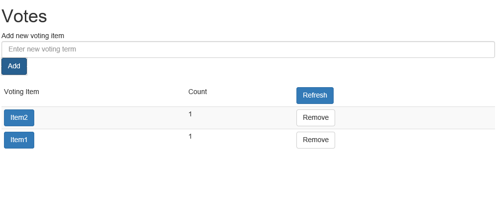

2.  When done using the application, exit the debugging session by selecting **Debug** then **Stop Debugging** (Shift+F5). This will uninstall the application from Service Fabric and if viewing in Service Fabric Explorer (SFX) you will see that it is no longer deployed.

Task 3: Configuration and Upgrade
---------------------------------

This section will demonstrate how to use Service Fabric configuration and perform a no downtime upgrade of the application.

1.  In order to make sure that we don’t remove the service fabric application from the cluster when debugging is stopped, change the application debug mode to “Auto Upgrade”. (right click voting project, go to properties, change the application debug mode to select “Auto Upgrade”

> 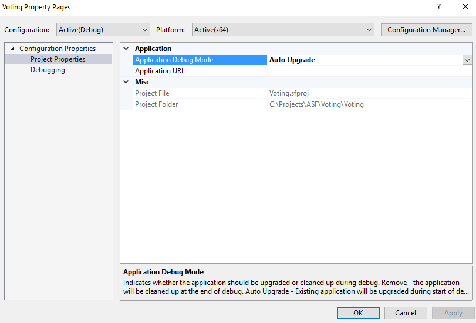

1.  Right click on the Voting project and select **Publish…**, the Publish Service Fabric Application dialog will appear. Select **PublishProfiles\\Local.xml** for the Target profile, which will select the Local Cluster for the Connection Endpoint and Local.xml for Application Parameters File. Unselect the” upgrade the application” checkbox if it is selected. (This step will ensure that we will have a running service fabric application during the upgrade step)

2.  In the VotesController.cs, “GetFile” Method change the folder name to read the new version number that we will be using in the publish option below.

    Change

    string path = string.Format(@"..\\VotingServicePkg.Code.1.0.0\\{0}", file);

    To

    string path = string.Format(@"..\\VotingServicePkg.Code.1.0.1\\{0}", file);

3.  Go to the Build Menu and Click Rebuild Solution.

4.  Right click on the Voting project and select **Publish…**, the Publish Service Fabric Application dialog will appear. Select **PublishProfiles\\Local.xml** for the Target profile, which will select the Local Cluster for the Connection Endpoint and Local.xml for Application Parameters File. Ensure the **Upgrade the Application** is selected this time.

> 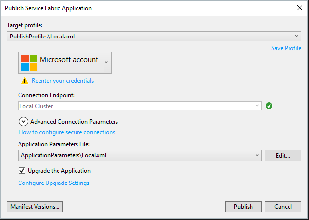

1.  Click the **Manifest Versions…** button, the Edit Versions dialog will be displayed. Expand VotingServicePkg. Then change the New Version column value to 1.0.1 for **VotingType**, **VotingServicePkg** and **Code (Changing code should automatically update the other two)**. Click **Save** to close the dialog. This updates the version numbers for the code package, service an application in *ApplicationManifest.xml* and *ServiceManifest.xml*.

> 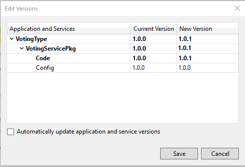

1.  Ensure the values are correct and click **Publish** which will start upgrading the application to your local cluster. You can watch progress in SFX by choosing the application fabric:/Voting in the navigation pane.

> 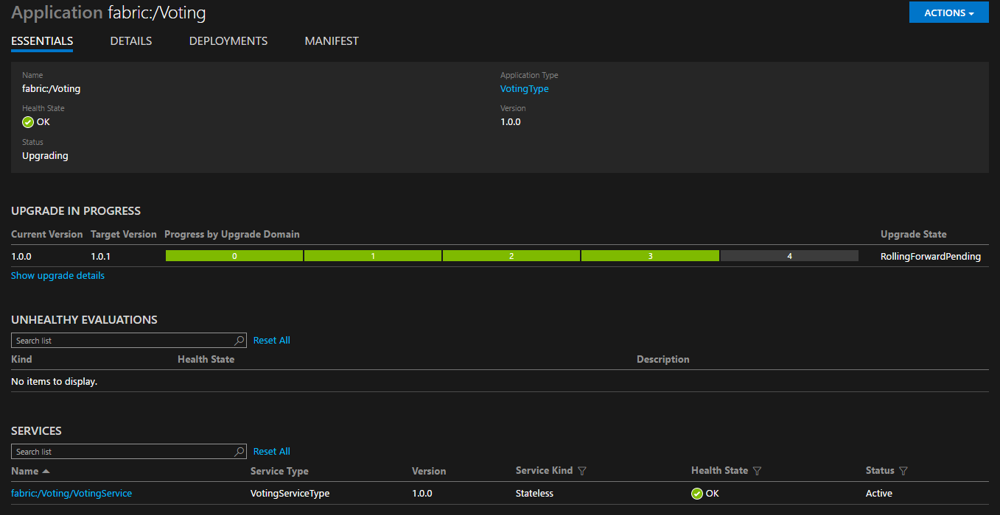
>
> This page shows the progress as each upgrade domain is being upgraded and shows the original and updated version number.

1.  Ensure the browser is pointing to the correct endpoint as the instance may have moved nodes during the upgrade. You’ll notice that all of the data you entered so far has been lost. This is because during a code upgrade each service being upgraded is restarted and because it is a stateless service when it was restarted it lost its cached data – In Service Fabric, you can build applications such that they are statefull so that you don’t lose the cached data.

2.  Next deploy more instances of the service. Visual Studio uses what is called Default Services defined in the ApplicationManifest.xml to deploy services. There is a limitation that you cannot change the configuration of a default application, so instead we’ll use the **Update-ServiceFabricService** Windows PowerShell command to update the number of instances. Open **Windows PowerShell** and type

    1.  Connect-ServiceFabricCluster

        and press enter. You should see output indicating you are connected to the cluster.

> b.

Update-ServiceFabricService -ServiceName fabric:/Voting/VotingService -Stateless -InstanceCount 3 -Force

> and press enter. You should see a message saying “Update service succeeded” and if you look in SFX, you’ll now see three instances in the navigation page and that the instance count has been changed to three.
>
> 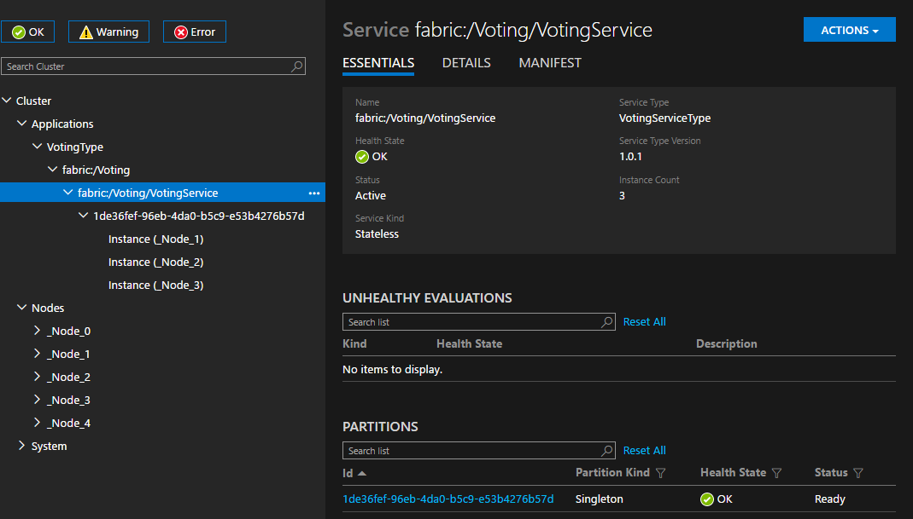

Task 4: Create the Service Fabric environment in Azure
------------------------------------------------------

Login
-----

1.  Launch a browser and navigate to https://portal.azure.com. Once prompted, login with your Microsoft Azure credentials.

<!-- -->

1.  **Note:** You may need to launch an "in-private" session in your browser if you have multiple Microsoft Accounts.

Create a new Service Fabric Cluster
-----------------------------------

1.  Click on the **+NEW** link.

1.  In the search box, search for “Service Fabric Cluster” and click on the Service Fabric Cluster link in the results

    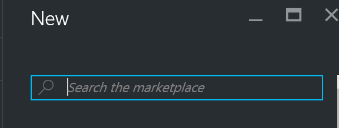

2.  Click on the “Create” button

3.  Set the following configuration on the “Basics” tab

    1.  Cluster Name: Some unique value ({your initials}p20xsflab)

    2.  User Name: demouser

    3.  Password: demo@pass12345

    4.  Subscription: If you have multiple subscriptions choose the subscription to execute your labs in.

    5.  Resource Group: P20XSFRG

    6.  Location: Choose the closest Azure region to you.

> 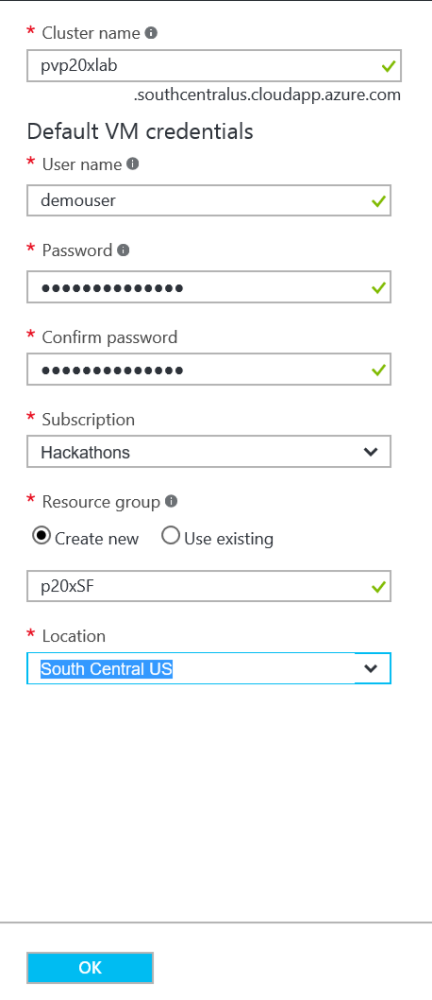

1.  Click **OK** to move to the next step.

2.  Set the following configuration on the “Configuration” tab

    1.  Node Type Count: 1

    2.  Under “Configure each node type” click on “Node Type 1 (Primary) Configure required settings”

        1.  Node Type Name: Voting

        2.  Select the Virtual machine size Standard\_D1\_V2 from the list and click Select

        3.  Leave every other settings as is and click OK

            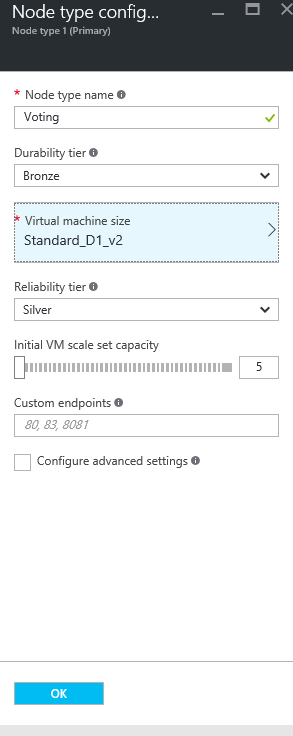

3.  In the “Cluster Configuration tab”, leave other settings as is as shown below and click OK

    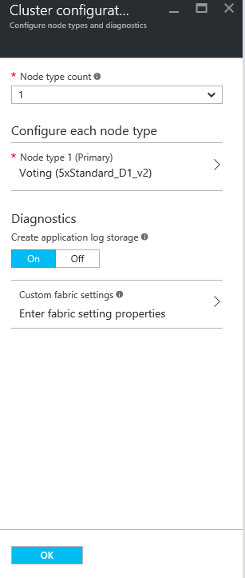

4.  In the Security tab change the security mode to “Unsecure” and click OK

5.  Under “Summary” click “Create”, This will submit a deployment of the cluster

    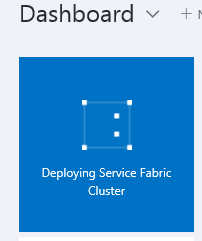

6.  After few minutes, you will see a service fabric cluster provisioned under your resource group s

Task 5: Deploy the application to Azure
---------------------------------------

1.  In Visual studio, right click on the “Voting” project and click on “Publish”. In the Target profile dropdown, select Cloud.xml. Select the appropriate Subscription account. Connection endpoint dropdown should be populated with the cluster we created in the previous step. Select the endpoint of the cluster in Azure. In the application parameter file dropdown, select Cloud.xml. Uncheck the “Upgrade the Application” check box if checked and if it is the first time you are deploying this application to the Azure cluster. During an upgrade, you will select this option to upgrade to a new version. Click on “Publish”. This will publish the “Voting” Application to the Service Fabric Cluster in Azure.

    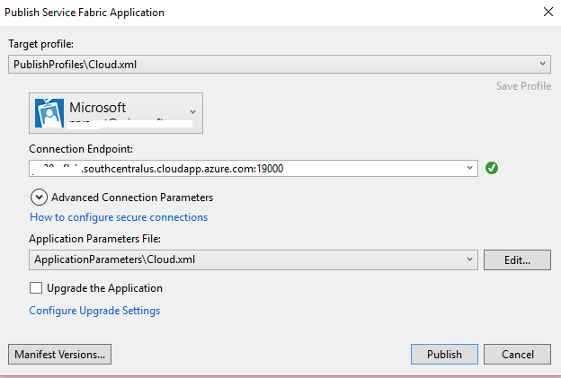

2.  Open the remote cluster in the service fabric explorer. For this, navigate to following explorer URL (Alternatively you can click on the explorer link in the service fabric cluster in Azure portal. To get to the cluster, select the resource group, select the service fabric cluster from the list of resources)

    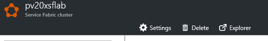

In this lab, you learned to create a simple service fabric application, used visual studio and service fabric explorer to develop and manage the application and deploy to local cluster and also in Azure.
