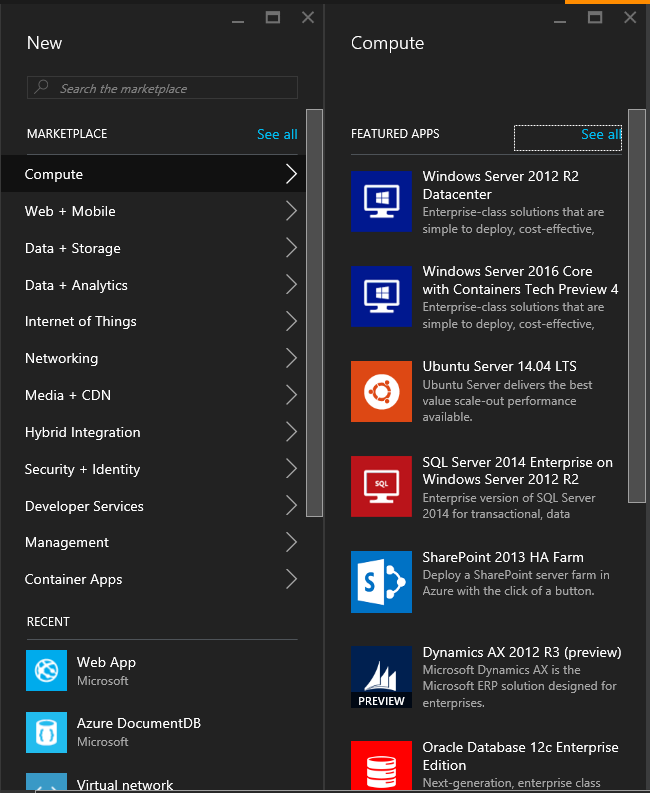
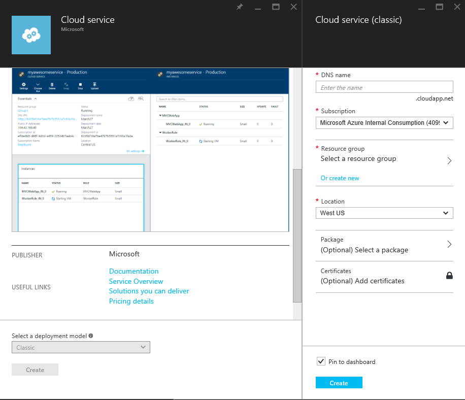

# USDX Hands-On Lab Checklist

Use this guide to verify that lab attendees have installed and configured the prerequisites.

## Software Prerequisites

- Windows 10 PC
- [Free MS FTE MSDN Subscription](http://subscriptions/)
- [Visual Studio 2015 Professional](https://go.microsoft.com/fwlink/?LinkId=691980&clcid=0x409)
- [Visual Studio Code](https://go.microsoft.com/fwlink/?LinkID=534107)
- [Visual Studio Windows 10 Developer Tools](https://go.microsoft.com/fwlink/p/?LinkId=619629)
- [Azure SDK for .NET (Version 2.8.1)](http://go.microsoft.com/fwlink/?linkid=518003&amp;clcid=0x409)
- [Azure Command Line Interface (CLI)](https://go.microsoft.com/?linkid=9828653&clcid=0x409)
- [SQL Server Management Studio](http://go.microsoft.com/fwlink/?LinkID=822301)
- [Power BI Desktop](https://go.microsoft.com/fwlink/?LinkId=521662&clcid=0x409)
- [Azure Service Fabric SDK for Visual Studio 2015](http://www.microsoft.com/web/handlers/webpi.ashx?command=getinstallerredirect&appid=MicrosoftAzure-ServiceFabric-VS2015)
- [Azure Storage Explorer](http://storageexplorer.com/)

## Requirements to Verify

- Sign in to Azure and verify that a subscription exists.
- Open Visual Studio, verify you can create an ASP.NET Web project (ASP.NETx MVC/Web API).
- Open Visual Studio, verify you can create a Blank Universal App (UWP).

## Activities: Verify Azure Subscription

### Azure Subscription

Welcome to the World of Azure!
- Navigate to [**https://portal.azure.com**](https://portal.azure.com)
- **Login** with your **Azure credentials** and second authentication
- Once signed in, you&#39;ll hit the landing page for the new portal which contains a customizable starting hub to help manage your services.

 
 
 

- On the left-hand menu, select **Subscriptions**

 
 
 

- In the **Subscriptions** blade, select one of the subscriptions
- Note: You may have multiple subscriptions and the names of those subscriptions may be different than shown below. Verify you have at least one subscription and close the Azure Portal.

 
  

 

## Activities: Verify ASP.NET MVC and UWP Project Templates.

### Verify ASP.NET MVC and UWP Project Templates

- Open **Visual Studio** and click **&#39;New Project...**&#39; under the &#39; **Start&#39;** section heading.
- Select **&#39;Web&#39;** from the templates menu and then verify **&#39;ASP.NET Web Application&#39;** is in the list of installed templates.
- Select **&#39;Windows&#39;** , **&#39;Universal&#39;** from the templates menu and then verify **&#39;Blank App (Universal Windows)&#39;** is in the list of installed templates.
- Close Visual Studio - no need to click OK.

 

 